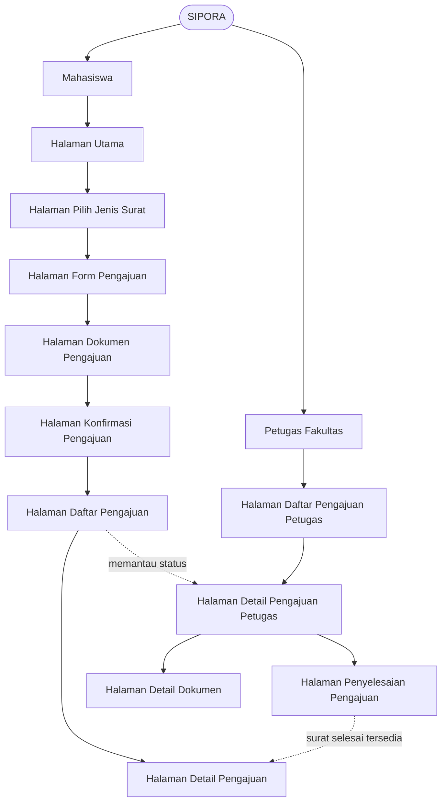
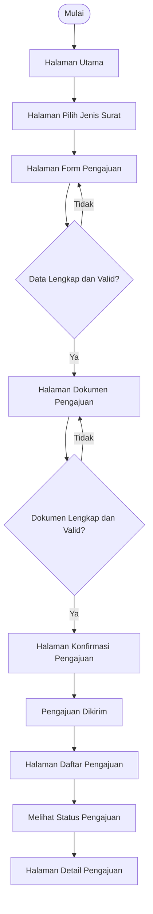
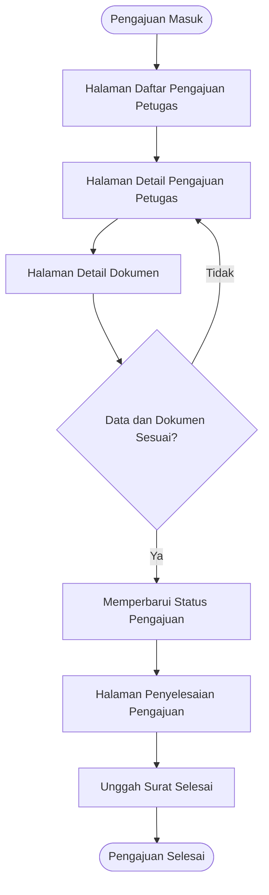

# Information Architecture SIPORA

## 1. Tujuan

Information Architecture (IA) SIPORA disusun untuk menggambarkan struktur informasi dan hubungan antarmuka yang diperlukan dalam mendukung proses pengajuan Surat Observasi dan Riset Akademik. Struktur ini diturunkan dari kebutuhan fungsional pada Tugas 4 sehingga setiap halaman memiliki keterkaitan yang jelas dengan kebutuhan yang harus dipenuhi.

IA ini membedakan halaman berdasarkan dua kelompok pengguna, yaitu **Mahasiswa** dan **Petugas Fakultas**. Halaman utama digunakan sebagai titik awal navigasi, sedangkan halaman lainnya disusun berdasarkan fungsi yang telah dipetakan pada Tugas 4.

---

## 2. Inventarisasi Halaman

Inventarisasi halaman berikut menggunakan nama halaman yang sama dengan bagian **Pemetaan Kebutuhan ke Antarmuka** pada Tugas 4.

| No. | Aktor            | Halaman                              | Kebutuhan yang Dipenuhi                                              | Prioritas   |
| --: | ---------------- | ------------------------------------ | -------------------------------------------------------------------- | ----------- |
|   1 | Mahasiswa        | **Halaman Utama**                    | Titik awal navigasi aplikasi                                         | Pendukung   |
|   2 | Mahasiswa        | **Halaman Pilih Jenis Surat**        | F-01 — Memilih jenis surat                                           | Must have   |
|   3 | Mahasiswa        | **Halaman Form Pengajuan**           | F-02 — Mengisi data pengajuan                                        | Must have   |
|   4 | Mahasiswa        | **Halaman Dokumen Pengajuan**        | F-03 — Mengunggah dokumen pendukung                                  | Must have   |
|   5 | Mahasiswa        | **Halaman Konfirmasi Pengajuan**     | F-04 — Mengirim pengajuan                                            | Must have   |
|   6 | Mahasiswa        | **Halaman Daftar Pengajuan**         | F-05 — Melihat status pengajuan                                      | Must have   |
|   7 | Mahasiswa        | **Halaman Detail Pengajuan**         | F-06 — Memperoleh surat selesai                                      | Could have  |
|   8 | Petugas Fakultas | **Halaman Daftar Pengajuan Petugas** | F-07 — Melihat daftar pengajuan                                      | Should have |
|   9 | Petugas Fakultas | **Halaman Detail Pengajuan Petugas** | F-08 — Memeriksa data pengajuan; F-10 — Memperbarui status pengajuan | Should have |
|  10 | Petugas Fakultas | **Halaman Detail Dokumen**           | F-09 — Memeriksa dokumen pendukung                                   | Should have |
|  11 | Petugas Fakultas | **Halaman Penyelesaian Pengajuan**   | F-11 — Mengunggah surat selesai                                      | Could have  |

> **Catatan:** Halaman Utama merupakan titik awal navigasi dan bukan pengganti salah satu kebutuhan F-01 sampai F-11. Seluruh kebutuhan fungsional F-01 sampai F-11 tetap mempertahankan pemetaan halaman sebagaimana ditetapkan pada Tugas 4.

---

## 3. Pengelompokan Halaman

### 3.1 Halaman Mahasiswa

Halaman mahasiswa mendukung proses utama pengajuan surat dari tahap awal hingga pemantauan hasil pengajuan.

1. **Halaman Utama**

   * Menjadi titik awal pengguna setelah membuka aplikasi.
   * Menyediakan akses menuju proses pengajuan dan informasi pengajuan yang telah dibuat.

2. **Halaman Pilih Jenis Surat**

   * Memungkinkan mahasiswa menentukan jenis surat yang dibutuhkan.
   * Memenuhi **F-01**.

3. **Halaman Form Pengajuan**

   * Menyediakan tempat untuk mengisi informasi yang diperlukan dalam pengajuan.
   * Memenuhi **F-02**.

4. **Halaman Dokumen Pengajuan**

   * Menyediakan area untuk melengkapi dokumen pendukung.
   * Memenuhi **F-03**.

5. **Halaman Konfirmasi Pengajuan**

   * Menampilkan ringkasan data dan dokumen sebelum pengajuan dikirim.
   * Mendukung proses pengiriman pengajuan.
   * Memenuhi **F-04**.

6. **Halaman Daftar Pengajuan**

   * Menampilkan daftar pengajuan milik mahasiswa beserta statusnya.
   * Memungkinkan mahasiswa mengetahui perkembangan pengajuan.
   * Memenuhi **F-05**.

7. **Halaman Detail Pengajuan**

   * Menampilkan informasi lebih lengkap mengenai suatu pengajuan.
   * Menjadi antarmuka bagi mahasiswa untuk memperoleh surat yang telah selesai.
   * Memenuhi **F-06**.

### 3.2 Halaman Petugas Fakultas

Halaman petugas mendukung pemeriksaan dan pemrosesan pengajuan yang telah dikirim oleh mahasiswa.

1. **Halaman Daftar Pengajuan Petugas**

   * Menampilkan pengajuan mahasiswa yang perlu diperiksa atau diproses.
   * Memenuhi **F-07**.

2. **Halaman Detail Pengajuan Petugas**

   * Menampilkan data pengajuan secara lebih lengkap untuk diperiksa.
   * Menjadi tempat petugas memperbarui status pengajuan.
   * Memenuhi **F-08** dan **F-10**.

3. **Halaman Detail Dokumen**

   * Menampilkan dokumen pendukung yang dikirim mahasiswa.
   * Membantu petugas memeriksa kelengkapan persyaratan.
   * Memenuhi **F-09**.

4. **Halaman Penyelesaian Pengajuan**

   * Menyediakan proses bagi petugas untuk mengunggah surat yang telah selesai.
   * Memenuhi **F-11**.

---

## 4. Struktur Informasi

Secara konseptual, SIPORA memiliki dua kelompok struktur berdasarkan aktor. Mahasiswa berfokus pada proses pengajuan dan pemantauan, sedangkan petugas fakultas berfokus pada pemeriksaan dan penyelesaian pengajuan.

Diagram tersebut menunjukkan bahwa struktur informasi SIPORA tidak hanya mengikuti urutan pengisian pengajuan, tetapi juga menggambarkan hubungan antara proses mahasiswa dan proses petugas fakultas.

---

## 5. Alur Informasi Mahasiswa

Alur utama mahasiswa mengikuti proses yang telah dirancang pada Tugas 4.

Struktur ini mempertahankan keputusan dan pengulangan yang terdapat pada user flow Tugas 4. Dengan demikian, Information Architecture tidak menggantikan user flow, tetapi menerjemahkan hasil analisis tersebut menjadi struktur halaman yang akan menjadi dasar perancangan wireframe dan UI.

---

## 6. Alur Informasi Petugas Fakultas

Alur petugas dimulai dari daftar pengajuan yang masuk dan berlanjut ke proses pemeriksaan hingga penyelesaian pengajuan.

Alur ini menunjukkan bahwa petugas tidak langsung mengunggah surat selesai. Data dan dokumen perlu diperiksa terlebih dahulu sebelum status pengajuan diperbarui dan surat selesai diunggah.

---

## 7. Halaman Utama

### Halaman Utama sebagai Main Screen

**Halaman Utama** ditetapkan sebagai halaman utama karena menjadi titik awal bagi mahasiswa untuk mengakses fungsi utama SIPORA. Halaman ini terutama berperan sebagai pusat navigasi menuju proses pengajuan dan pemantauan pengajuan, sedangkan fungsi inti pengajuan tetap direpresentasikan oleh halaman-halaman yang telah dipetakan pada kebutuhan F-01 sampai F-05.

Halaman utama mendukung kebutuhan **Must have** secara tidak langsung dengan menyediakan akses yang jelas menuju rangkaian fungsi utama, yaitu memilih jenis surat, mengisi pengajuan, melengkapi dokumen, mengirim pengajuan, dan melihat status pengajuan.

### Keterkaitan dengan Must-have

Lima kebutuhan **Must have** pada Tugas 4 adalah:

* **F-01** — Memilih jenis surat
* **F-02** — Mengisi data pengajuan
* **F-03** — Mengunggah dokumen pendukung
* **F-04** — Mengirim pengajuan
* **F-05** — Melihat status pengajuan

Karena lima kebutuhan tersebut merupakan rangkaian utama layanan SIPORA, Halaman Utama dirancang sebagai titik masuk yang membantu mahasiswa menemukan dua aktivitas utama, yaitu **memulai pengajuan** dan **memantau pengajuan yang telah dibuat**.

---

## 8. Hubungan IA dengan Tugas 4

Information Architecture ini memiliki hubungan langsung dengan hasil analisis kebutuhan pada Tugas 4.

| Hasil Tugas 4                  | Penerapan pada Tugas 5                                                                     |
| ------------------------------ | ------------------------------------------------------------------------------------------ |
| User Persona                   | Menjadi dasar pengelompokan halaman Mahasiswa dan Petugas Fakultas                         |
| Kebutuhan Fungsional           | Menjadi dasar penentuan halaman dan fungsi antarmuka                                       |
| MoSCoW                         | Menentukan fungsi utama yang diprioritaskan                                                |
| Pemetaan Kebutuhan → Antarmuka | Menjadi sumber nama halaman dan kebutuhan yang dipenuhi                                    |
| User Flow                      | Menjadi dasar hubungan dan urutan antarhalaman                                             |
| Kebutuhan Nonfungsional        | Menjadi pertimbangan dalam penyusunan struktur yang sederhana, jelas, dan mudah dinavigasi |

Dengan hubungan tersebut, perancangan antarmuka pada Tugas 5 tidak dibuat terpisah dari analisis kebutuhan sebelumnya, tetapi merupakan kelanjutan dari kebutuhan dan alur yang telah ditetapkan pada Tugas 4.

---

## 9. Keterkaitan dengan Wireframe

Information Architecture ini menjadi dasar penyusunan wireframe Tugas 5. Wireframe minimal akan menampilkan:

1. **Halaman Utama** sebagai main screen.
2. **Halaman Daftar Pengajuan** sebagai supporting screen yang mewakili kebutuhan **F-05 — Melihat status pengajuan**.

Pemilihan Halaman Daftar Pengajuan sebagai supporting screen didasarkan pada prioritas **Must have** dan tujuan utama SIPORA, yaitu membantu mahasiswa mengetahui perkembangan pengajuan yang telah dibuat.

Pada wireframe, setiap area antarmuka akan diberi anotasi mengenai fungsi dan ID kebutuhan yang dipenuhinya agar hubungan antara kebutuhan, struktur informasi, dan rancangan UI dapat ditelusuri dengan jelas.

---

## 10. Kesimpulan

Information Architecture SIPORA disusun berdasarkan kebutuhan fungsional dan pemetaan antarmuka pada Tugas 4. Struktur ini membagi informasi berdasarkan dua aktor utama, yaitu Mahasiswa dan Petugas Fakultas, serta mempertahankan nama halaman dan ID kebutuhan F-01 sampai F-11 agar konsisten dengan analisis sebelumnya.

Halaman Utama berfungsi sebagai titik awal navigasi, sedangkan halaman lainnya merepresentasikan fungsi yang lebih spesifik sesuai kebutuhan masing-masing aktor. Struktur ini selanjutnya digunakan sebagai dasar untuk membuat wireframe, menentukan keputusan desain UI, dan mengimplementasikan satu halaman utama SIPORA pada Flutter.
